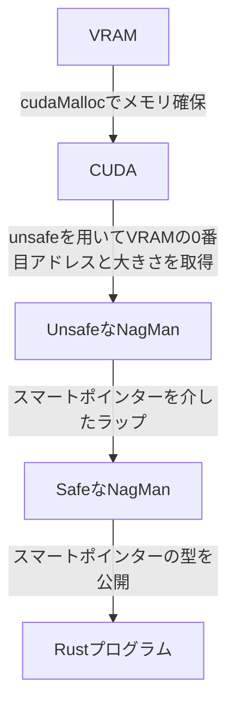

# NagMan

## はじめに

<div style="text-align: center;">
<strong>⚠️ NagMan は実験的なプログラムであり、正常に動作することは保証できません! ⚠️</strong>
</div>

## 概要

NagMan (Nvidia GPU Memory Manager) はページングシステムとスマートポインターを高度に利用した新たな GPU ライブラリです。
NagMan には次の画期的 ~~(悪足掻きとも言う)~~ な技術を採用しました。

1. **ページングシステムとスマートポインターを用いた、所有権に基づく VRAM 管理システム**
2. **Rust のエイリアシングルールに違反しない Cut-ItIs**
3. **必要最低限の厳格な unsafe**

## 使用方法

次のコードを実行します。

```shell
$ cargo add nagman

```

---

## Cut-ItIs

Cut-ItIs(Cut it is)により、1byte を 1bit 単位で切り分けて並列処理を行います。
Cut-ItIs は Bit cut into pieces system の略です。
1byte(8bit)を bit に切り分けたり、配列を切り分けたりと、Cut-ItIs は何でもできます。

これにより、**Rust の「可変参照は一度に 1 つしか存在できない」** という原則に違反することなく、可変な並列計算が可能です。

---

## NugMan による VRAM 取得の流れ



NagMan は内部に Unsafe な NugMan と Safe な NugMan に分かれています。

**Unsafe な NugMan は、主に以下の処理を行っています。**

1. FFI を用いた CUDA の制御
2. VRAM の取得や解放
3. カーネルの実行
